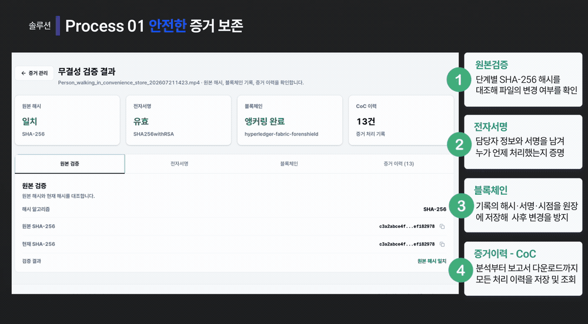
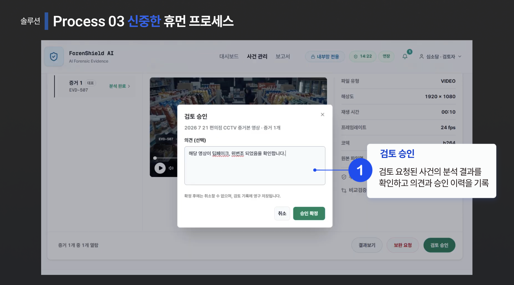
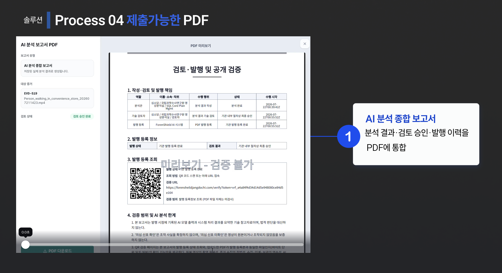
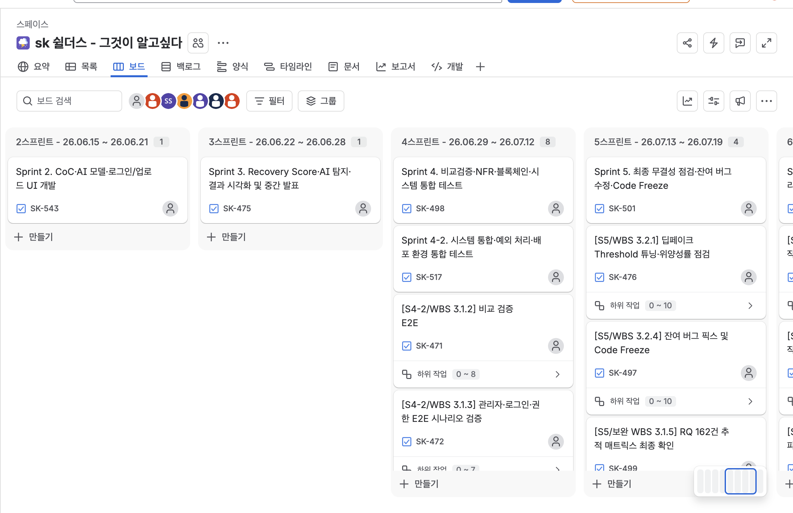
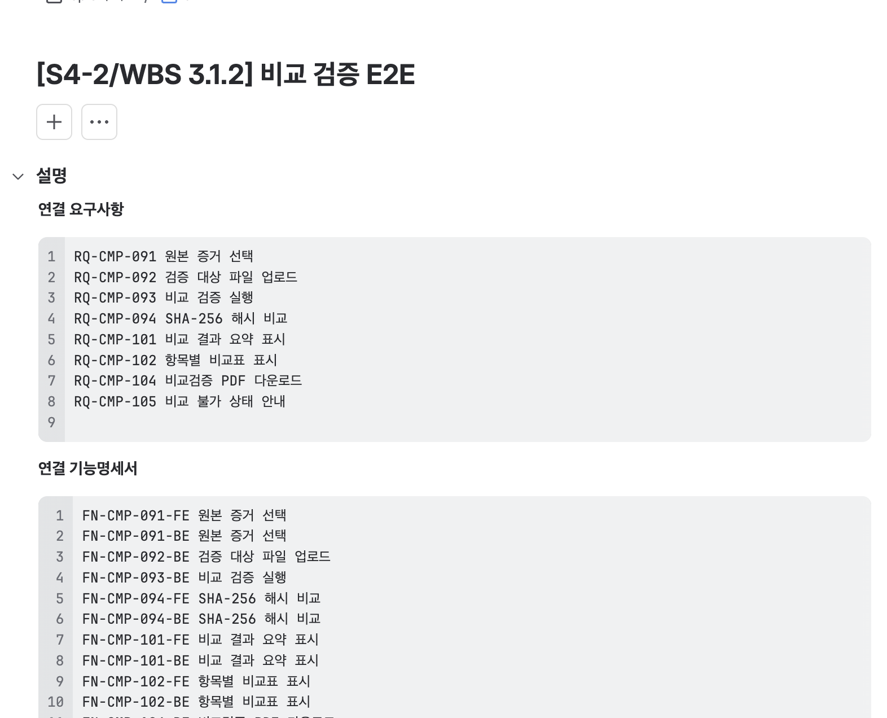
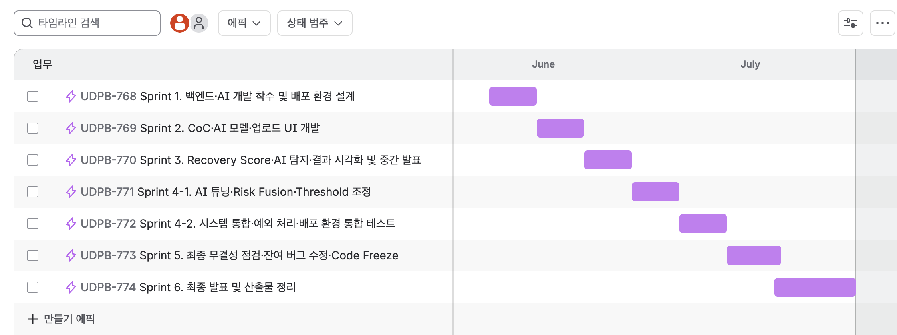

# ForenShield AI

> 영상 증거 등록부터 AI 분석, 검토·승인, 보고서 발급과 외부 검증까지 연결한 딥페이크 포렌식 플랫폼

**📅 2026.05.15 ~ 2026.07.31 · 👥 Team Project · 🏆 최우수상**

✍️ [Tech Blog](https://mini-0923.tistory.com/category/Troubleshooting) · 🎬 [Demo](https://www.youtube.com/watch?v=jiSKK2kp57U)


---

## My Contribution

- **Frontend** — 사건·증거 관리부터 AI 분석 결과, 검토·승인, 보고서·검증까지 주요 화면 구현
- **Backend** — 인증·인가, 사건 목록 조회, PDF 보고서 발급 영역 구현
- **Refactoring** — 대용량 조회, 반복 통계 조회, 승인 Transaction, 동시 승인 중복 작업 문제를 재현하고 개선

---

## Backend Scope

> 제가 구현하고 이후 리팩토링한 주요 Backend 영역입니다.

```text
backend/
└─ src/main/java/com/example/demo/
   ├─ security/
   │  ├─ JwtAuthenticationFilter.java       # 인증 필터
   │  └─ JwtTokenProvider.java              # JWT 발급·검증
   ├─ service/
   │  ├─ auth/
   │  │  └─ AuthService.java                # 인증
   │  ├─ evidence/
   │  │  ├─ EvidenceDetailService.java      # C1
   │  │  └─ CaseReviewService.java          # C3
   │  ├─ user/
   │  │  └─ MyPageService.java              # C1
   │  ├─ dashboard/
   │  │  ├─ EvidenceStatsService.java       # C2
   │  │  └─ DashboardStatsCache.java        # 통계 캐시
   │  ├─ report/
   │  │  ├─ ReportPdfService.java           # PDF 발급
   │  │  ├─ ReportPdfStorageService.java    # C3
   │  │  ├─ ReportIssueTaskService.java     # C3 · C4
   │  │  ├─ ReportIssueTaskProcessor.java   # C3
   │  │  └─ ReportIssueTaskRecoveryService.java # C3
   │  └─ blockchain/
   │     └─ BlockchainAnchorService.java    # C3
   └─ repository/
      ├─ CaseListQueryRepository.java       # C1
      ├─ AnalysisRequestRepository.java     # C2
      ├─ ReportIssueTaskRepository.java     # C3
      └─ ReportIssueTaskInsertRepository.java # C4
```

**C1** 목록 조회 개선 · **C2** 통계 API 개선 · **C3** 승인/보고서 발급 분리 · **C4** 중복 발급 작업 방지

---

## Problem Solving

- **사건 목록 조회** — 10,000건 조건에서 p95 **3.23s → 0.40s** · [Troubleshooting](https://mini-0923.tistory.com/9)
- **통계 API** — 동일 사용자 동시 요청에서 통계 SQL **40회 → 1회** · [Troubleshooting](https://mini-0923.tistory.com/14)
- **보고서 발급** — 5초 외부 지연 조건에서 승인 Transaction **5,172ms → 16ms** · [Troubleshooting](https://mini-0923.tistory.com/15)
- **중복 발급 방지** — 동시 승인 10건에서 생성되던 발급 Task **10건 → 1건** · [Troubleshooting](https://mini-0923.tistory.com/17)

---

## Workflow


**사건 등록 → 증거 보존 → AI 분석 → 검토·승인 → 보고서 발급 → QR/PDF 검증**

- **증거 관리** — 영상 등록, SHA-256 검증, CoC 처리 이력 관리
- **AI 분석** — 분석 요청, 진행 상태 추적, 상세 결과 조회
- **검토·승인** — 검토자 배정, 승인 및 보완 요청
- **보고서 검증** — PDF 발급, QR 조회, SHA-256 비교

---

## System Architecture


Next.js → Spring Boot → PostgreSQL / Redis / S3 / RabbitMQ → AI Worker

---

## Screens

### 01. 증거 관리 · 무결성 검증



영상 증거의 SHA-256, 전자서명, 블록체인 앵커와 CoC 처리 이력을 확인합니다.

### 02. AI 분석 · 검토




AI 분석 결과를 확인하고 검토자가 승인 또는 보완 요청을 처리합니다.

### 03. 보고서 · 외부 검증




승인된 분석 결과를 PDF로 발급하고 QR과 SHA-256을 이용해 외부에서 검증합니다.

---

## Tech Stack

### Backend


### Data


### Frontend


### Infra


### AI / Media


---

## Project Management & Docs

요구사항과 기능을 연결해 작업 단위를 정의하고, Sprint별로 개발 일정을 관리했습니다.

<details>
<summary><b>🗂 Jira 기반 협업 방식 보기</b></summary>

<br>

### Sprint 단위 작업 관리



기능 개발·통합 테스트·버그 수정을 Sprint 단위로 관리했습니다.

### 요구사항 ↔ 기능명세 ↔ Jira Task



`요구사항 ID(RQ) → 기능명세 ID(FN) → Jira Task`를 연결해 구현 범위를 추적했습니다.

### Sprint Timeline



개발 착수부터 통합 테스트·Code Freeze·최종 산출물까지 Sprint별 일정을 관리했습니다.

</details>

📄 [요구사항 명세서](https://docs.google.com/spreadsheets/d/1nj8sLVO9Y8pRHsacLSlMzTulv-4AlAk0/edit?gid=1200642718#gid=1200642718)<br>
📄 [기능 명세서](https://docs.google.com/spreadsheets/d/19dD72vgj0kyQA8T4oZjTckR_suT5WqCJ/edit?usp=sharing&ouid=112282862503330137253&rtpof=true&sd=true)<br>
📄 [기능 요건 정의서](https://drive.google.com/file/d/17WA2TkitxsnvhaEH7gYh9-pxUXhvsEfK/view?usp=sharing)<br>
📊 [WBS](https://docs.google.com/spreadsheets/d/1fH5CeWaGAcZ0oWaBqmID9hCUsyH08djy/edit?usp=sharing&ouid=112282862503330137253&rtpof=true&sd=true)

---

<details>
<summary><b>🚀 Local Run</b></summary>

### 사전 준비

`Node.js 20+` · `pnpm` · `JDK 17` · `Python 3` · `FFmpeg`

```bash
git clone https://github.com/kimini02/forenshield-ai-portfolio.git
cd forenshield-ai-portfolio
```

각 서비스는 별도 터미널에서 실행합니다.

### 01. Backend

```bash
cd backend
JWT_SECRET_KEY=local-development-only-secret-key-32bytes ./gradlew bootRun
```

### 02. AI Server

```bash
cd ai
python3 -m venv .venv
source .venv/bin/activate
pip install -r requirements.txt
cp .env.example .env
uvicorn app.main:app --port 8000
```

### 03. Frontend

```bash
cd frontend
cp .env.example .env.local
pnpm install
pnpm dev
```

| Service | URL |
|---|---|
| Web | `http://localhost:3000` |
| Backend Swagger | `http://localhost:8080/swagger-ui/index.html` |
| AI Swagger | `http://localhost:8000/docs` |

> 기본 로컬 프로필은 H2, 로컬 분석 모드, simulated 블록체인 앵커를 사용합니다. 운영 환경에서는 PostgreSQL, Redis, RabbitMQ, S3 설정이 추가로 필요합니다.

</details>

---

## Links

- ✍️ [Tech Blog](https://mini-0923.tistory.com/category/Troubleshooting)
- 🎬 [Demo](https://www.youtube.com/watch?v=jiSKK2kp57U)
