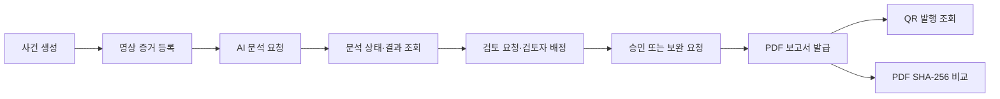
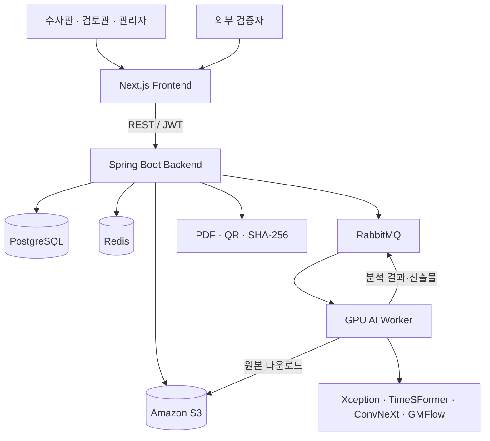
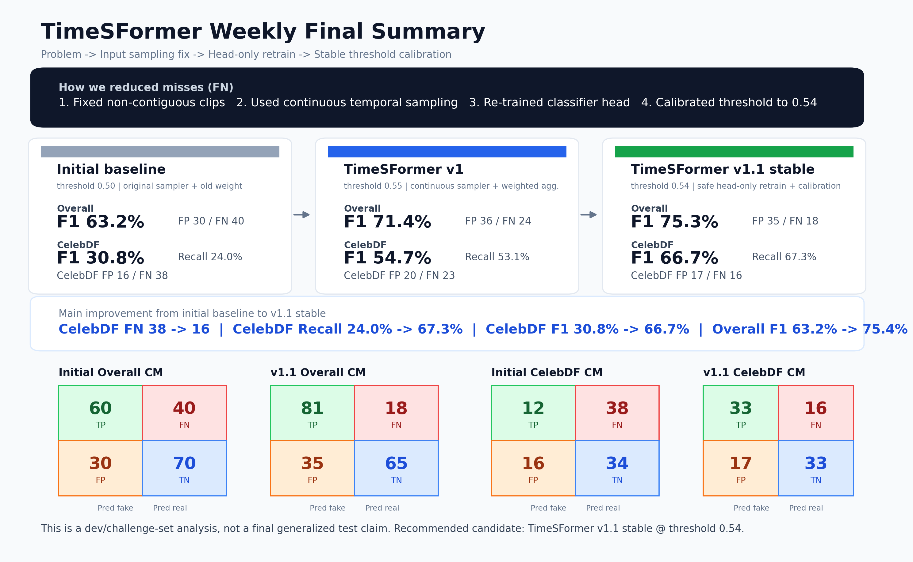

# ForenShield AI

> 영상 증거 등록부터 AI 분석, 검토·승인, 보고서 발급과 외부 검증까지 연결한 딥페이크 포렌식 플랫폼

**Team Project · 약 2개월 반 · 김민희: Frontend / Backend / AI**

Notion Portfolio · Tech Blog · Demo Video `(링크 추가 예정)`

---

## 프로젝트 소개

ForenShield AI는 영상의 딥페이크 여부만 판별하는 단일 분석 도구가 아닙니다. 수사관이 사건과 영상 증거를 등록한 시점부터 AI 분석, 검토관 승인, PDF 보고서 발급, 외부 무결성 검증까지 이어지는 **디지털 증거 업무 흐름 전체**를 하나의 서비스로 연결했습니다.

| 구분 | 내용 |
|---|---|
| 개발 기간 | 약 2개월 반 |
| 형태 | 팀 프로젝트 |
| 주요 사용자 | 수사관 · 검토관 · 기관 관리자 · 외부 검증자 |
| 개인 역할 | Frontend · Backend · AI · 서비스 연동 |
| 핵심 가치 | 분석 결과뿐 아니라 상태, 권한, 검토 이력과 보고서 무결성까지 관리 |

### 핵심 사용자 흐름



---

## Monorepo 구성

기존에 분리되어 있던 세 저장소를 하나의 공개 포트폴리오 저장소로 통합했습니다.

```text
forenshield-ai-portfolio/
├── frontend/   # Next.js 사용자 화면
├── backend/    # Spring Boot 업무·검증 API
├── ai/         # FastAPI·GPU 분석 파이프라인
└── docs/       # 포트폴리오 이미지
```

| 디렉터리 | 역할 | 주요 기술 |
|---|---|---|
| [`frontend`](./frontend/) | 사건·증거·분석·검토·보고서·공개 검증 UI | Next.js, React, TypeScript |
| [`backend`](./backend/) | REST API, 상태 전이, 접근 제어, 보고서·검증 | Java 17, Spring Boot, JPA |
| [`ai`](./ai/) | AI API, GPU 분석 파이프라인, 모델 결과·시각화 산출물 | Python, FastAPI, PyTorch |

> 서비스 전체는 팀 프로젝트이며, 아래 `My Contribution`에는 김민희가 직접 구현·개선한 범위를 구분해 작성했습니다.

---

## 주요 기능

### 사건 및 영상 증거 관리

- 사건 생성과 영상 증거 등록
- 원본 파일 메타데이터와 SHA-256 관리
- 사건·증거 단위 분석 상태 및 결과 조회
- Chain of Custody(CoC) 이력 확인

### 비동기 AI 분석

- 장시간 실행되는 분석 작업 상태 추적
- polling을 통한 진행 상태 갱신과 완료 후 상세 결과 재조회
- 공간·시간·움직임 관점의 영상 딥페이크 분석
- 분석 점수, 의심 구간, 대표 프레임과 시각화 산출물 제공

### 역할 기반 검토 Workflow

- 수사관의 검토 요청과 관리자의 검토자 배정
- 검토관 승인 또는 보완 요청
- 역할·기관·부서·사건 배정 관계를 함께 확인하는 접근 제어
- 승인 상태와 PDF 보고서 발급 조건 연결

### 보고서 발급 및 외부 검증

- 승인된 분석 결과의 PDF 보고서 생성
- 검증 URL을 담은 QR 코드와 발행 정보 제공
- 공개 페이지에서 보고서 발행 이력 조회
- 사용자가 보유한 PDF의 SHA-256과 등록 해시 비교

---

## 시스템 아키텍처



---

## My Contribution — 김민희

### Frontend

- 사건·증거 상세 화면과 분석 결과 탭 구현 및 개선
- 2초 간격 polling, 숨김 탭 요청 생략, 연속 실패·timeout 안내
- terminal 상태 도달 후 사건 상세를 재조회해 최신 분석 결과 반영
- 검토 요청·검토 의견·승인 보고서로 이어지는 화면 흐름 연결
- PDF 미리보기, 보고서 목록, QR 발행 조회와 공개 PDF 검증 화면 구현
- Web Crypto API로 PDF를 서버에 업로드하지 않고 SHA-256 해시만 전달
- 실제 API와 Mock API를 분리해 백엔드 없이 화면 개발이 가능한 환경 구성

### Backend

- 분석 취소 가능 상태를 `QUEUED`, `ANALYZING`으로 제한하고 terminal 상태 보존 테스트 추가
- 프론트엔드가 사용하는 사건·증거·분석 응답 계약 보완
- 검토자 배정 시 역할과 함께 기관·부서 범위를 검증하도록 접근 제어 강화
- 승인 결과를 기반으로 PDF 보고서와 QR 검증 URL을 생성하는 발급 흐름 구현
- QR 발행 조회와 사용자 PDF의 SHA-256 무결성 비교 API 분리
- 공개 보고서 URL, 한글 폰트, 저장 보고서 해시 등 발급·검증 환경 보완
- MockMvc·통합 테스트로 상태 전이, 권한 거절과 해시 검증 시나리오 확인

### AI

- FastAPI 서버 기본 구조와 `GET /health`, `POST /ai/analyze` Mock API 구현
- Xception, TimeSFormer, ConvNeXt, GMFlow 등 공간·시간·움직임 모델 비교
- 연속 프레임 sampling, head-only 재학습, weighted aggregation과 threshold calibration 실험
- TimeSFormer의 오탐을 줄이기 위한 ConvNeXt weighted fusion 실험
- GMFlow의 일반화 한계를 확인하고 최종 판정 모델이 아닌 보조 신호로 역할 재정의
- GPU 분석 결과의 대표 프레임·heatmap 등 시각화 산출물을 S3와 응답에 연결

> AWS 인프라 전체, S3 업로드 파이프라인 전체, RabbitMQ 전체 설계와 Hyperledger Fabric 구축은 팀 구현 범위입니다.

---

## 주요 문제 해결

### 1. 장시간 분석 상태와 화면 동기화

AI 분석 중 화면 이동이나 일시적인 요청 실패가 발생해도 진행 상태가 끊기지 않도록 서버 상태 기반 polling을 구현했습니다. 브라우저 탭이 숨겨지면 요청을 생략하고, 연속 실패·timeout을 안내하며, terminal 상태에서는 상세 API를 다시 조회해 최종 결과를 동기화했습니다.

### 2. 분석 취소 상태를 whitelist로 제한

기존에는 `COMPLETED`만 취소를 막아 다른 terminal 상태가 취소 경로에 들어갈 수 있었습니다. 취소 가능한 상태를 `QUEUED`, `ANALYZING`으로 한정하고 완료·실패 요청이 HTTP 400으로 거절되며 DB 상태가 보존되는지 테스트했습니다.

### 3. 검토자 권한을 자원 범위까지 확장

`REVIEWER` 역할만 확인하던 배정 로직에 기관·부서 범위 검증을 추가했습니다. 공통 `UserScopeSupport`를 적용하고 다른 부서 검토자 배정이 `INVALID_REVIEWER_SCOPE`로 거절되는 통합 테스트를 구성했습니다.

### 4. QR 발행 조회와 PDF 파일 검증 분리

QR은 보고서 발행 사실을 조회하지만 사용자가 보유한 PDF의 동일성까지 보장하지 않습니다. 발행 정보 조회와 사용자 PDF SHA-256 비교를 API·UI에서 분리하고, 파일 원본 대신 브라우저에서 계산한 해시만 서버에 전달했습니다.

### 5. AI 미탐 감소와 모델 조합 실험

비연속 프레임 sampling을 continuous temporal sampling으로 바꾸고 classifier head 재학습, weighted aggregation과 threshold calibration을 비교했습니다.

| 지표 | Initial baseline | TimeSFormer v1.1 stable |
|---|---:|---:|
| Overall F1 | 63.2% | 75.3% |
| Celeb-DF Recall | 24.0% | 67.3% |
| Celeb-DF F1 | 30.8% | 66.7% |
| Celeb-DF False Negative | 38 | 16 |

별도의 199개 공통 샘플 실험에서는 `0.7 × TimeSFormer + 0.3 × ConvNeXt` 조합이 AUC `0.834`, F1 `0.756`을 기록하고 False Positive를 `36 → 21`로 줄였습니다.

> 위 수치는 개발·challenge set 기반 실험 결과이며 최종 일반화 성능이나 운영 정확도를 의미하지 않습니다.



---

## 기술 스택

| 영역 | 기술 |
|---|---|
| Frontend | Next.js 16, React 19, TypeScript, Tailwind CSS, shadcn/ui |
| Backend | Java 17, Spring Boot 3, Spring Security, Spring Data JPA |
| AI / Media | Python, FastAPI, PyTorch, OpenCV, FFmpeg, ffprobe |
| AI Models | Xception, TimeSFormer, ConvNeXt, GMFlow |
| Data / Messaging | PostgreSQL, H2, Redis, RabbitMQ, Amazon S3 |
| Report / Integrity | OpenPDF, ZXing, SHA-256, Web Crypto API |
| Test | JUnit 5, MockMvc, AssertJ |
| Team Infra | Docker, Kubernetes, AWS EKS, RDS, ElastiCache, Argo CD, GitHub Actions |

---

## 실행 방법

각 애플리케이션의 세부 환경 변수와 실행 방법은 하위 README를 참고해 주세요.

- [Frontend 실행 방법](./frontend/README.md)
- [Backend 실행 방법](./backend/README.md)
- [AI 서버 실행 방법](./ai/README.md)

기본 개발 포트는 다음과 같습니다.

| 애플리케이션 | 기본 주소 |
|---|---|
| Frontend | `http://localhost:3000` |
| Backend | `http://localhost:8080` |
| AI API | `http://localhost:8000` |

---

## 검증 상태

| 영역 | 결과 |
|---|---|
| Frontend | Next.js production build 통과 |
| AI | Python 전체 소스 compile 통과 |
| Backend | 전체 299개 테스트 중 296개 통과, 3개 실패 |

백엔드의 기존 실패 항목은 `FileValidationIntegrationTest` 2건의 테스트 컨텍스트 의존성 누락과 `EvidenceHlsLookupServiceTest` 1건의 우선순위 기대값 불일치입니다.

---

## Links

- Notion Portfolio: `링크 추가 예정`
- Tech Blog: `링크 추가 예정`
- Demo Video: `링크 추가 예정`
