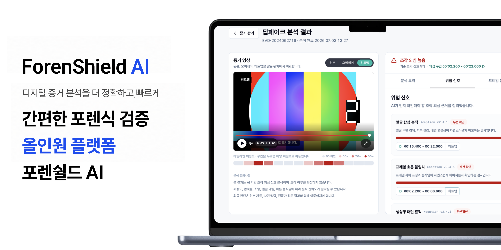
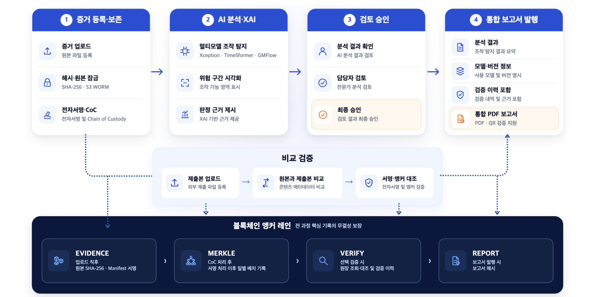
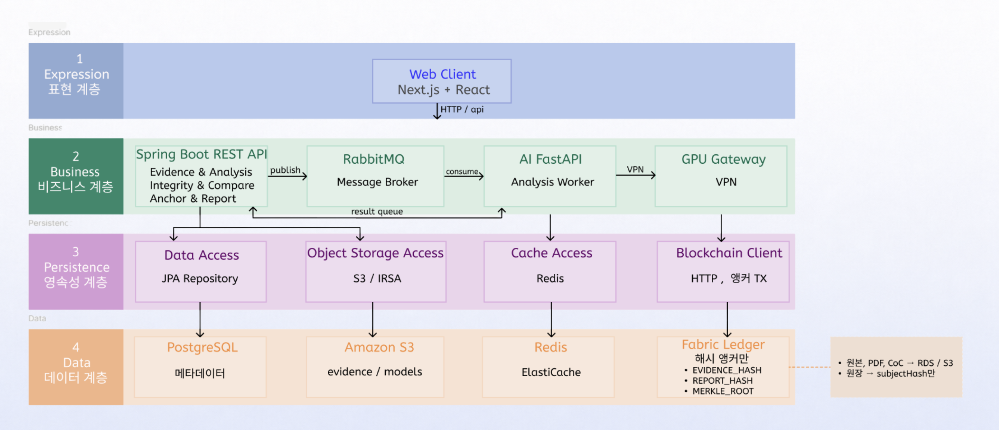
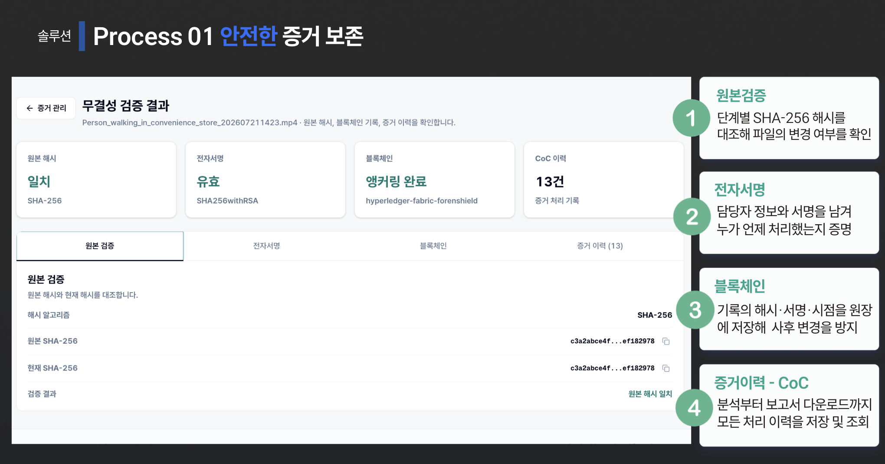
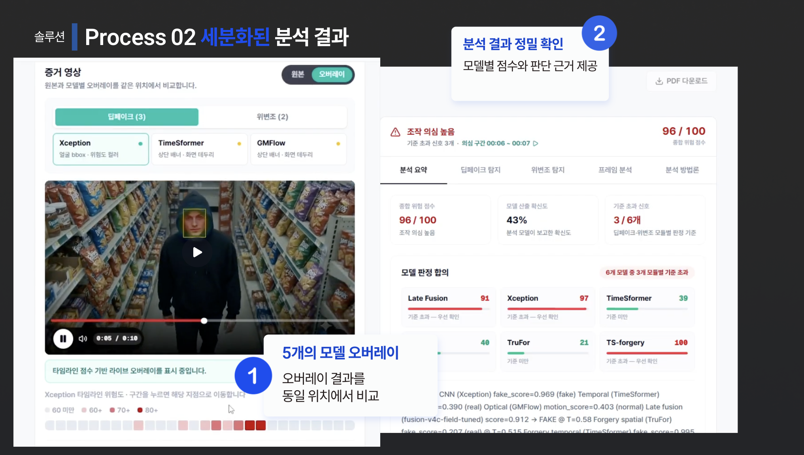

# ForenShield AI

> 영상 증거 등록부터 AI 분석, 검토·승인, 보고서 발급과 외부 검증까지 연결한 딥페이크 포렌식 플랫폼

**📅 2026.05.15 ~ 2026.07.31 · 👥 Team Project · 🏆 최우수상**

✍️ [Tech Blog](https://mini-0923.tistory.com/category/Troubleshooting) · 🎬 [Demo](https://www.youtube.com/watch?v=jiSKK2kp57U)



---

## My Contribution

- **Frontend** — 사건·증거 관리부터 AI 분석 결과, 검토·승인, 보고서·검증까지 주요 화면 구현
- **Backend** — 인증·인가, 사건 목록 조회, PDF 보고서 발급 영역 구현
- **Refactoring** — 대용량 조회, 반복 통계 조회, 승인 Transaction, 동시 승인 중복 작업 문제를 재현하고 개선

---

## Problem Solving

- **사건 목록 조회** — 10,000건 조건에서 p95 **3.23s → 0.40s** · [Troubleshooting](https://mini-0923.tistory.com/9)
- **통계 API** — 동일 사용자 동시 요청에서 통계 SQL **40회 → 1회** · [Troubleshooting](https://mini-0923.tistory.com/14)
- **보고서 발급** — 5초 외부 지연 조건에서 승인 Transaction **5,172ms → 16ms** · [Troubleshooting](https://mini-0923.tistory.com/15)
- **중복 발급 방지** — 동시 승인 10건에서 생성되던 발급 Task **10건 → 1건** · [Troubleshooting](https://mini-0923.tistory.com/17)

---

## Workflow

**사건 등록 → 증거 보존 → AI 분석 → 검토·승인 → 보고서 발급 → QR/PDF 검증**



- **증거 관리** — 영상 등록, SHA-256 검증, CoC 처리 이력 관리
- **AI 분석** — 분석 요청, 진행 상태 추적, 상세 결과 조회
- **검토·승인** — 검토자 배정, 승인 및 보완 요청
- **보고서 검증** — PDF 발급, QR 조회, SHA-256 비교

---

## System Architecture



```text
Next.js → Spring Boot → PostgreSQL / Redis / S3 / RabbitMQ → AI Worker
```

---

## Screens

### 01. 증거 관리 · 무결성 검증



영상 증거의 SHA-256, 전자서명, 블록체인 앵커와 CoC 처리 이력을 확인합니다.

### 02. AI 분석 · 검토



AI 분석 결과를 확인하고 검토자가 승인 또는 보완 요청을 처리합니다.

### 03. 보고서 · 외부 검증


승인된 분석 결과를 PDF로 발급하고 QR과 SHA-256을 이용해 외부에서 검증합니다.

---

## Tech Stack

**Backend** Java 17 · Spring Boot · Spring Security · Spring Data JPA<br>
**Data** PostgreSQL · Redis · RabbitMQ · Amazon S3<br>
**Frontend** Next.js · React · TypeScript · Tailwind CSS<br>
**Infra** Docker · Kubernetes · AWS<br>
**AI / Media** FastAPI · FFmpeg

---

## Project Management & Docs

기능을 단위 작업으로 나누어 **Jira Kanban**으로 진행 상태를 관리하고, 요구사항과 기능 기준을 문서화해 팀 개발 기준으로 사용했습니다.

📄 [요구사항 명세서](https://drive.google.com/file/d/18Y_JEMMTfivIaEygiZfX2B4ReLYvYn3w/view?usp=drivesdk)<br>
📄 [기능 명세서](https://drive.google.com/file/d/1txArNcf5UiIWhrO8St1wj1NCX1QTWP80/view?usp=drivesdk)<br>
📊 [WBS](https://docs.google.com/spreadsheets/d/1GbQNk5yW8Pf1L6WSxx_YFSXqacV8IZveyUWPlXxEY5g/edit?usp=drivesdk)

---

<details>
<summary><b>🚀 Local Run</b></summary>

### 사전 준비

`Node.js 20+` · `pnpm` · `JDK 17` · `Python 3` · `FFmpeg`

```bash
git clone https://github.com/kimini02/forenshield-ai-portfolio.git
cd forenshield-ai-portfolio
```

각 서비스는 별도 터미널에서 실행합니다.

### 01. Backend

```bash
cd backend
JWT_SECRET_KEY=local-development-only-secret-key-32bytes ./gradlew bootRun
```

### 02. AI Server

```bash
cd ai
python3 -m venv .venv
source .venv/bin/activate
pip install -r requirements.txt
cp .env.example .env
uvicorn app.main:app --port 8000
```

### 03. Frontend

```bash
cd frontend
cp .env.example .env.local
pnpm install
pnpm dev
```

| Service | URL |
|---|---|
| Web | `http://localhost:3000` |
| Backend Swagger | `http://localhost:8080/swagger-ui/index.html` |
| AI Swagger | `http://localhost:8000/docs` |

> 기본 로컬 프로필은 H2, 로컬 분석 모드, simulated 블록체인 앵커를 사용합니다. 운영 환경에서는 PostgreSQL, Redis, RabbitMQ, S3 설정이 추가로 필요합니다.

</details>

---

## Links

- ✍️ [Tech Blog](https://mini-0923.tistory.com/category/Troubleshooting)
- 🎬 [Demo](https://www.youtube.com/watch?v=jiSKK2kp57U)
