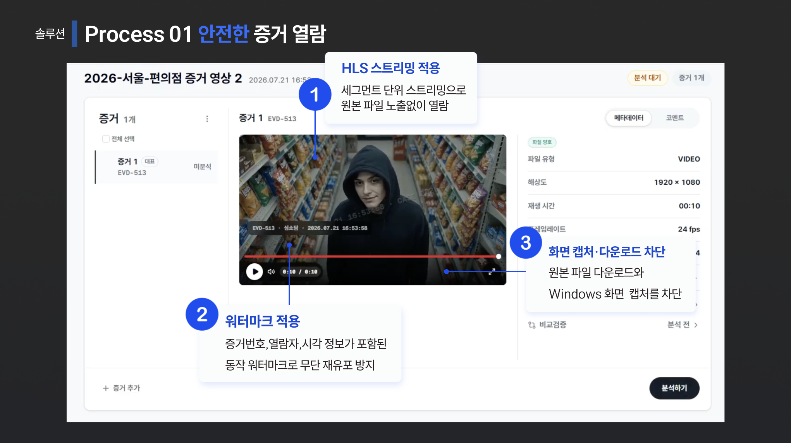

# ForenShield AI

> 영상 증거 등록부터 AI 분석, 검토·승인, 보고서 발급 및 외부 검증까지 연결하는 딥페이크 포렌식 플랫폼

**📅 개발 기간: 약 2개월 반 · 👥 Team Project**

📘 [Notion Portfolio](TODO) · ✍️ [Tech Blog](https://mini-0923.tistory.com/category/Troubleshooting) · 🎬 [Demo](https://youtu.be/OynSzlmiHDk?si=EZMhmrof8DY5XY36)


ForenShield AI는 단순히 영상의 딥페이크 여부를 판별하는 데서 끝나지 않고,  
영상이 증거로 등록된 이후 분석·검토·보고서 발급·외부 검증까지 이어지는  
업무 흐름을 하나의 플랫폼으로 구현한 프로젝트입니다.

---

## Problem

딥페이크 탐지 기술이 발전해도 실제 포렌식 업무는  
탐지 결과만으로 끝나지 않습니다.

| Problem | ForenShield AI |
|---|---|
| 분석과 검토 과정이 사람 중심으로 분리되어 있음 | AI 분석부터 검토·승인까지 하나의 workflow로 연결 |
| 원본 파일의 변경 여부와 처리 이력을 확인해야 함 | SHA-256과 CoC 기반으로 증거 처리 과정을 기록 |
| 분석·검토·보고서 발급 과정이 서로 분리되어 있음 | 사건 등록부터 보고서 발급까지 하나의 플랫폼에서 관리 |

---

## 핵심 기능


### 사건 · 증거 관리

영상 증거를 사건 단위로 등록하고 SHA-256 원본 검증, 전자서명, 블록체인 앵커링, CoC 증거 이력으로 무결성을 관리합니다.

### AI 분석

장시간 분석 작업의 상태를 추적하고 완료 후 상세 분석 결과를 제공합니다.

### 검토 · 승인

검토 요청, 검토자 배정, 승인·보완 요청까지 역할 기반 workflow를 제공합니다.

### 보고서 · 외부 검증

분석 결과를 PDF로 발행하고 QR 기반 발행 정보 조회와 PDF SHA-256 비교를 제공합니다.

---

## System Architecture


```text
Next.js → Spring Boot → PostgreSQL / S3 / RabbitMQ → AI Worker
```

위 구성은 팀 프로젝트 전체 시스템 아키텍처입니다.

---

## Tech Stack

### 📱 Frontend


### 💾 Backend


### 🗄 Data & Messaging


### 🔃 DevOps


### 🤖 AI / Media


---

## 실행 방법

### 사전 준비

`Node.js 20+` · `pnpm` · `JDK 17` · `Python 3` · `FFmpeg`

```bash
git clone https://github.com/kimini02/forenshield-ai-portfolio.git
cd forenshield-ai-portfolio
```

각 서비스는 별도 터미널에서 실행합니다.

### 01. Backend

```bash
cd backend
JWT_SECRET_KEY=local-development-only-secret-key-32bytes ./gradlew bootRun
```

### 02. AI Server

```bash
cd ai
python3 -m venv .venv
source .venv/bin/activate
pip install -r requirements.txt
cp .env.example .env
uvicorn app.main:app --port 8000
```

### 03. Frontend

```bash
cd frontend
cp .env.example .env.local
pnpm install
pnpm dev
```

| Service | URL |
|---|---|
| Web | `http://localhost:3000` |
| Backend Swagger | `http://localhost:8080/swagger-ui/index.html` |
| AI Swagger | `http://localhost:8000/docs` |

> 기본 로컬 프로필은 H2, 로컬 분석 모드, simulated 블록체인 앵커를 사용합니다. 운영 환경에서는 PostgreSQL, Redis, RabbitMQ, S3 설정이 추가로 필요합니다.

---

## 🤖 AI-Assisted Development

개발 과정에서 AI를 요구사항 정리, 설계 검토, 테스트 케이스 도출과 문서화에 활용합니다. AI 결과는 그대로 반영하지 않고 코드 diff, 테스트 결과, API 계약과 도메인 정책을 직접 검증합니다.

| Document | Description |
|---|---|
| [Agent Guide](./AGENTS.md) | 저장소 구조, 핵심 정책과 작업별 원본 문서 안내 |
| [Development Workflow](./docs/agent/development-workflow.md) | 명세 작성부터 구현·검토까지의 협업 절차 |
| [Verification Guide](./docs/agent/verification.md) | Frontend, Backend, AI 구성 요소별 검증 기준 |
| [Feature Spec Template](./docs/agent/feature-spec-template.md) | 복잡한 기능 변경을 위한 간단한 명세 템플릿 |

---

## 서비스 구현 화면

### 01. 사건 및 영상 증거 등록 · 무결성 검증

**안전한 증거 열람**



**증거 무결성 검증**


영상 증거를 안전하게 열람하고 SHA-256 원본 검증, 전자서명, 블록체인 앵커링, CoC 처리 이력으로 무결성을 확인합니다.

### 02. AI 분석 및 결과 조회


분석 진행 상태를 확인하고 완료 후 상세 분석 결과를 조회합니다.

### 03. 검토 및 승인


분석 결과를 검토하고 승인 또는 보완 요청을 처리합니다.

### 04. PDF 보고서


승인된 분석 결과를 PDF 보고서로 발행합니다.

### 05. QR / PDF 검증


QR로 보고서 발행 정보를 조회하고 보유한 PDF의 SHA-256을 비교합니다.

---

## Problem Solving

### 01. [JPA 대용량 목록 조회 최적화 — Over-fetching과 Object Materialization 병목 개선](https://mini-0923.tistory.com/9)

### 02. [반복 COUNT Query 통합과 Single-flight를 통한 통계 API 최적화](https://mini-0923.tistory.com/14)

---

## Links

- [Notion Portfolio](TODO)
- [Tech Blog](https://mini-0923.tistory.com/category/Troubleshooting)
- [Demo](https://youtu.be/OynSzlmiHDk?si=EZMhmrof8DY5XY36)
