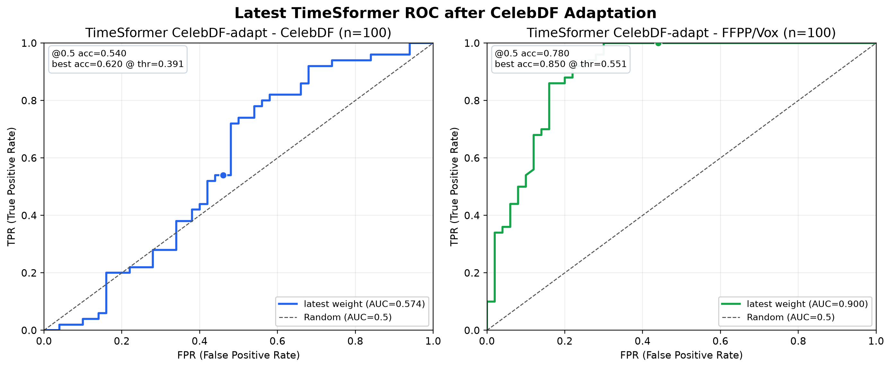
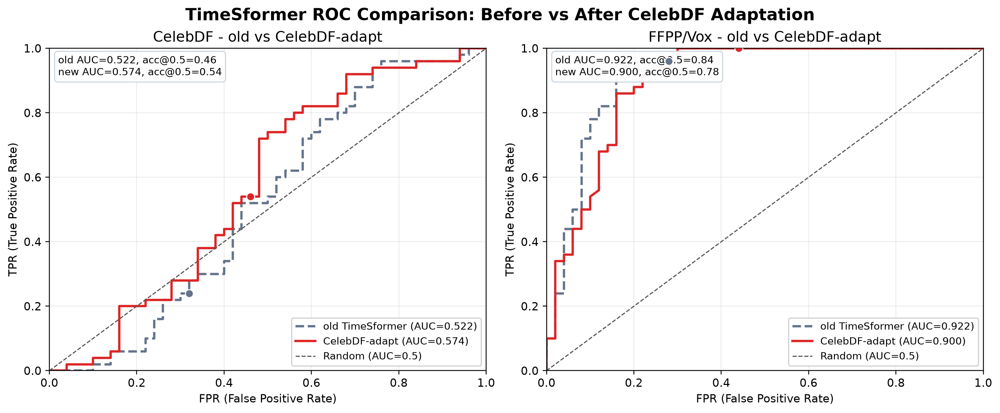
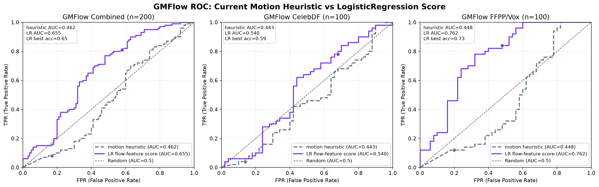

# 딥페이크 영상 탐지 성능 개선 실험 정리

> 작성일: 2026-06-24  
> 실행 환경: welabs GPU server, `/home/sk4team/forenShield-ai`  
> 대상 모델: Xception, TimeSformer, GMFlow  
> 목적: Celeb-DF 성능 개선 가능성 확인, TimeSformer 재벤치마크, GMFlow threshold 및 score 개선 가능성 검증

---

## 1. 결론 요약

이번 실험의 핵심 결론은 다음과 같다.

| 항목 | 결과 | 판단 |
|---|---:|---|
| TimeSformer CelebDF AUC | `0.5216 -> 0.5740` | 소폭 개선 |
| TimeSformer FFPP/Vox AUC | `0.9220 -> 0.9002` | 약간 하락 |
| GMFlow motion instability raw AUC | CelebDF `0.4426`, FFPP/Vox `0.4476` | 단독 분류기로 부적합 |
| GMFlow LR feature score AUC | combined 5-fold `0.6548` | 보조 신호 가능성 있음 |
| 최종 권장 구조 | Xception + TimeSformer main, GMFlow auxiliary | 현재 가장 현실적 |

정리하면, **TimeSformer를 CelebDF로 추가 학습하면 CelebDF 성능은 조금 올라가지만 FFPP/Vox 성능이 일부 깎인다.** 따라서 새 가중치를 바로 교체하기보다는, 다음 단계에서 **CelebDF + FFPP/Vox 혼합 fine-tuning과 profile별 validation**으로 안정성을 다시 확인하는 것이 맞다.

GMFlow는 기존 motion heuristic만으로는 fake/real 분리 방향이 불안정하다. LogisticRegression으로 flow feature를 학습하면 combined AUC는 좋아지지만, profile을 바꿔 테스트하면 일반화가 약하다. 따라서 GMFlow는 최종 fake 판정의 주 모델이 아니라 **움직임 이상 보조 근거, 품질 신호, explainability 신호**로 두는 것이 안전하다.

---

## 2. 모델별 역할 정리

| 모델 | 역할 | 현재 판단 |
|---|---|---|
| Xception | 얼굴 crop/frame 기반 공간적 위조 흔적 탐지 | 안정적인 spatial baseline |
| TimeSformer | 얼굴 sequence 기반 시간적 위조 흔적 탐지 | 성능 개선의 주 대상 |
| GMFlow | optical flow 기반 움직임/시간 불일치 분석 | 보조 신호로 사용 권장 |

현재 ForenShield AI에서 가장 현실적인 설계는 다음과 같다.

```text
final deepfake decision
  = Xception spatial score
  + TimeSformer temporal score
  + GMFlow motion auxiliary signal
  + quality / limitation flags
```

GMFlow는 최종 score에 가중치를 주기보다, 다음과 같은 용도로 두는 것이 좋다.

- 얼굴 움직임이 비정상적으로 흔들리는지 설명하는 보조 근거
- 영상 품질, 압축, 움직임 과다 등 모델 신뢰도 조정 신호
- Xception/TimeSformer 결과가 애매할 때 추가 참고 신호

---

## 3. 데이터 및 누수 점검

Celeb-DF 재학습용 train split은 이미 준비되어 있었다.

| split | fake | real | path |
|---|---:|---:|---|
| Celeb-DF train | 200 | 200 | `data/train/video/celeb-df-v2/{fake,real}` |
| Celeb-DF benchmark/test | 50 | 50 | `data/benchmark/video-benchmark-datasets/celebdf/{fake,real}` |
| FFPP/Vox benchmark | 50 | 50 | `data/benchmark/video-benchmark-datasets/ffpp_vox/{fake,real}` |

확인한 내용:

- `data/train/video/celeb-df-v2/manifest.json`: 총 400개, fake 200 + real 200
- `data/test/video/celeb-df-v2/manifest.json`: 총 100개
- train/test source overlap: `0`
- train/test file overlap: `0`

즉, 1차 기준으로는 CelebDF train과 test/benchmark 간 직접 누수는 확인되지 않았다.

---

## 4. TimeSformer 재학습

### 4.1 실행 목적

기존 TimeSformer는 FF++ fake와 Vox/FF++ real 중심으로 학습되어 CelebDF에서 약했다.  
따라서 CelebDF train fake/real을 추가로 사용해 in-domain 성능을 올릴 수 있는지 확인했다.

### 4.2 실행 설정

| 항목 | 값 |
|---|---|
| script | `scripts/infer/video_transformer_finetune.py` |
| model | `timesformer` |
| init weights | `models/test/video/timesformer/v1.0.0/timesformer_finetuned.pth` |
| train fake | `data/train/video/celeb-df-v2/fake` |
| train real | `data/train/video/celeb-df-v2/real` |
| max per class | `100` |
| epochs | `3` |
| batch size | `1` |
| learning rate | `1e-5` |
| output | `timesformer-celebdf-adapt-20260624-011100.pth` |

실행 명령:

```bash
cd /home/sk4team/forenShield-ai

PYTHONUNBUFFERED=1 PYTHONPATH=/home/sk4team/forenShield-ai \
.venv/bin/python scripts/infer/video_transformer_finetune.py \
  --root /home/sk4team/forenShield-ai \
  --model timesformer \
  --train-fake-dir data/train/video/celeb-df-v2/fake \
  --train-real-dir data/train/video/celeb-df-v2/real \
  --exclude-dirs \
    data/test/video/celeb-df-v2/fake \
    data/test/video/celeb-df-v2/real \
    data/benchmark/video-benchmark-datasets/celebdf/fake \
    data/benchmark/video-benchmark-datasets/celebdf/real \
    data/benchmark/video-benchmark-datasets/ffpp_vox/fake \
    data/benchmark/video-benchmark-datasets/ffpp_vox/real \
  --max-per-class 100 \
  --epochs 3 \
  --batch-size 1 \
  --lr 1e-5 \
  --init-weights models/test/video/timesformer/v1.0.0/timesformer_finetuned.pth \
  --output models/test/video/timesformer/v1.0.0/timesformer-celebdf-adapt-20260624-011100.pth
```

### 4.3 학습 로그 요약

| epoch | loss | train acc |
|---:|---:|---:|
| 1/3 | `0.7588` | `0.470` |
| 2/3 | `0.7385` | `0.470` |
| 3/3 | `0.7248` | `0.505` |

학습 정확도만 보면 충분히 강한 수렴은 아니다. 다만 최종 판단은 train accuracy가 아니라 benchmark AUC로 해야 한다.

---

## 5. TimeSformer 재벤치마크

### 5.1 평가 설정

| 항목 | 값 |
|---|---|
| script | `scripts/infer/video_transformer_benchmark_infer.py` |
| model | `timesformer` |
| weights | `timesformer-celebdf-adapt-20260624-011100.pth` |
| threshold | `0.5` |
| max clips | `4` |
| CelebDF eval | fake 50 + real 50 |
| FFPP/Vox eval | fake 50 + real 50 |

FFPP/Vox 평가는 중간에 한 번 `Segmentation fault`가 발생했으나, 저장된 66개 결과와 resume run 34개 결과를 합쳐 총 100개 기준으로 계산했다.

### 5.2 기존 모델 대비 결과

| profile | model | AUC | @0.5 acc | best acc | best threshold |
|---|---|---:|---:|---:|---:|
| CelebDF | 기존 TimeSformer | `0.5216` | `0.46` | `0.60` | `0.2944` |
| CelebDF | CelebDF-adapt | `0.5740` | `0.54` | `0.62` | `0.3911` |
| FFPP/Vox | 기존 TimeSformer | `0.9220` | `0.84` | `0.89` | `0.5372` |
| FFPP/Vox | CelebDF-adapt | `0.9002` | `0.78` | `0.85` | `0.5513` |

### 5.3 변화량

| profile | AUC delta | @0.5 acc delta | best acc delta | 해석 |
|---|---:|---:|---:|---|
| CelebDF | `+0.0524` | `+0.08` | `+0.02` | 목표 도메인에서 소폭 개선 |
| FFPP/Vox | `-0.0218` | `-0.06` | `-0.04` | 기존 강점 일부 손실 |

### 5.4 새 TimeSformer confusion matrix

Threshold `0.5` 기준:

| profile | TP | FP | TN | FN | acc | precision | recall | F1 |
|---|---:|---:|---:|---:|---:|---:|---:|---:|
| CelebDF | 27 | 23 | 27 | 23 | `0.54` | `0.54` | `0.54` | `0.54` |
| FFPP/Vox | 50 | 22 | 28 | 0 | `0.78` | `0.6944` | `1.00` | `0.8197` |

### 5.5 해석

CelebDF-adapt 모델은 CelebDF fake를 더 잘 잡도록 점수를 올렸지만, real 영상도 함께 fake 쪽으로 끌려 올라가는 문제가 있다. 그래서 CelebDF AUC는 개선되었지만 아직 강한 분리라고 보긴 어렵다.

FFPP/Vox에서는 fake recall은 매우 높지만 real false positive가 증가했다. 이는 CelebDF fine-tuning이 기존 FFPP/Vox domain separation을 조금 흐리게 만든 것으로 볼 수 있다.

따라서 현재 새 가중치는 다음처럼 다루는 것이 좋다.

| 선택지 | 권장 여부 | 이유 |
|---|---|---|
| 기존 TimeSformer 즉시 교체 | 보류 | FFPP/Vox 성능 하락 |
| CelebDF 전용 실험 모델로 보관 | 권장 | CelebDF 개선은 확인됨 |
| 혼합 도메인 fine-tuning 재시도 | 강력 권장 | CelebDF 개선과 FFPP/Vox 유지 모두 필요 |

---

## 6. GMFlow threshold 튜닝

### 6.1 목적

GMFlow의 기존 motion instability score는 학습된 확률이 아니라 optical flow feature 기반 motion anomaly heuristic이다.  
따라서 threshold `0.5`가 적절한지, profile별로 조정하면 성능이 나아지는지 확인했다.

### 6.2 실행 입력

| profile | input |
|---|---|
| CelebDF | `results/infer/gmflow-celebdf-benchmark-20260622-0142-v2/datasets/infer_summary.json` |
| FFPP/Vox | `results/infer/gmflow-ffpp-vox-benchmark-20260622-0544-v2/datasets/infer_summary.json` |

실행 명령:

```bash
cd /home/sk4team/forenShield-ai

python3 scripts/eval/analyze_optical_flow_threshold.py \
  results/infer/gmflow-celebdf-benchmark-20260622-0142-v2/datasets/infer_summary.json \
  results/infer/gmflow-ffpp-vox-benchmark-20260622-0544-v2/datasets/infer_summary.json \
  --score-key motionInstabilityScore \
  --step 0.01 \
  -o results/infer/gmflow_threshold_analysis_20260624-011219.json
```

### 6.3 결과

| profile | AUC | fake mean | real mean | gap | @0.5 acc | best acc | best threshold |
|---|---:|---:|---:|---:|---:|---:|---:|
| CelebDF | `0.4426` | `0.2124` | `0.2809` | `-0.0685` | `0.45` | `0.54` | `0.0873` |
| FFPP/Vox | `0.4476` | `0.3472` | `0.4069` | `-0.0597` | `0.46` | `0.59` | `0.1731` |

### 6.4 해석

두 profile 모두 fake mean이 real mean보다 낮다. 즉 현재 GMFlow motion instability score는 기대 방향과 반대로 움직이는 구간이 있다.

Threshold를 낮추면 accuracy를 조금 올릴 수는 있지만, 이는 모델이 fake를 잘 분리한다기보다 낮은 threshold로 fake recall을 억지로 확보하는 쪽에 가깝다.

결론:

- GMFlow 기존 motion instability score는 단독 딥페이크 분류기로 사용하기 어렵다.
- `threshold=0.5`는 현재 flow heuristic에 맞지 않는다.
- profile별 threshold 튜닝은 보조적으로 가능하지만, 핵심 성능 개선책은 아니다.

---

## 7. GMFlow feature 기반 score 개선

### 7.1 목적

기존 `motion_anomaly_score` 하나만 쓰지 않고, flow feature들을 입력으로 LogisticRegression/MLP를 학습하면 fake/real 분리력이 개선되는지 확인했다.

사용 feature:

| feature | 의미 |
|---|---|
| `flow_mag_pair_min` | 프레임 pair 평균 flow의 최소값 |
| `flow_mag_pair_max` | 프레임 pair 평균 flow의 최대값 |
| `flow_mag_pair_range` | pair별 flow 변동 폭 |
| `flow_mag_iqr` | flow magnitude의 사분위 범위 |
| `temporal_jitter` | 시간적 흔들림 |
| `flow_mean` | 전체 평균 flow |
| `motion_anomaly_score` | 기존 heuristic score |

### 7.2 기존 motion instability baseline

| scope | AUC | @0.5 acc | best acc | best threshold |
|---|---:|---:|---:|---:|
| combined | `0.4622` | `0.455` | `0.535` | `0.1500` |
| CelebDF | `0.4426` | `0.450` | `0.540` | `0.0873` |
| FFPP/Vox | `0.4476` | `0.460` | `0.590` | `0.1731` |

### 7.3 LogisticRegression 결과

모델:

```text
StandardScaler + LogisticRegression(class_weight=balanced)
```

5-fold out-of-fold 기준:

| scope | AUC | @0.5 acc | best acc | best threshold |
|---|---:|---:|---:|---:|
| combined | `0.6548` | `0.615` | `0.645` | `0.5122` |
| CelebDF | `0.5396` | `0.550` | `0.590` | `0.5363` |
| FFPP/Vox | `0.7616` | `0.680` | `0.730` | `0.5130` |

Combined 5-fold confusion matrix:

| threshold | TP | FP | TN | FN | acc | precision | recall | F1 |
|---:|---:|---:|---:|---:|---:|---:|---:|---:|
| `0.5` | 81 | 58 | 42 | 19 | `0.615` | `0.5827` | `0.81` | `0.6778` |
| `0.5122` | 77 | 48 | 52 | 23 | `0.645` | `0.6160` | `0.77` | `0.6844` |

### 7.4 Profile holdout 일반화

Profile을 통째로 바꿔 테스트하면 성능이 크게 약해진다.

| train | test | AUC | @0.5 acc | best acc | 판단 |
|---|---|---:|---:|---:|---|
| FFPP/Vox | CelebDF | `0.5576` | `0.55` | `0.57` | 약함 |
| CelebDF | FFPP/Vox | `0.5044` | `0.50` | `0.53` | 거의 랜덤 |

### 7.5 해석

LogisticRegression은 기존 GMFlow heuristic보다 combined 성능을 개선한다. 하지만 profile holdout에서 일반화가 약하므로 아직 finalScore 입력으로 교체하기에는 부족하다.

MLP도 실험했지만 n=200 규모에서는 안정적인 개선을 보이지 않았다. 현재 데이터 크기에서는 MLP보다 LogisticRegression이 더 해석 가능하고 안전하다.

권장:

- GMFlow LR score는 연구용/보조 score로 보관
- 서비스 finalScore에는 0 가중치 유지, 필요 시 별도 보조 근거로만 표시
- 더 큰 train/validation split 확보 후 재검증

---

## 8. 최신 ROC 그래프

아래 그래프들은 2026-06-24에 새로 생성한 최신 실험 결과 기준이다.

### 8.1 TimeSformer CelebDF-adapt profile별 ROC



이 그래프는 새로 학습한 `timesformer-celebdf-adapt-20260624-011100.pth`를 CelebDF와 FFPP/Vox에 각각 적용한 결과다.

- CelebDF: AUC `0.574`, @0.5 acc `0.540`
- FFPP/Vox: AUC `0.900`, @0.5 acc `0.780`

### 8.2 TimeSformer 기존 모델 vs CelebDF-adapt 비교



이 그래프는 CelebDF 추가 fine-tuning 전후의 ROC를 비교한다.

- CelebDF에서는 AUC가 `0.522 -> 0.574`로 개선되었다.
- FFPP/Vox에서는 AUC가 `0.922 -> 0.900`으로 소폭 하락했다.

즉, 단일 도메인 적응은 목표 도메인 성능을 올릴 수 있지만, 기존 도메인 일반화 성능을 일부 훼손할 수 있다.

### 8.3 GMFlow 기존 heuristic vs LogisticRegression score



이 그래프는 GMFlow 기존 `motion_anomaly_score` 기반 움직임 불안정성 지표와 flow feature LogisticRegression score를 비교한다.

- Combined: AUC `0.462 -> 0.655`
- CelebDF: AUC `0.443 -> 0.540`
- FFPP/Vox: AUC `0.448 -> 0.762`

LogisticRegression score는 기존 heuristic보다 개선되지만, profile holdout 일반화가 약하므로 현재는 보조 score로만 사용하는 것이 적절하다.

---

## 9. 산출물 경로

### 9.1 TimeSformer

| 종류 | 경로 |
|---|---|
| 재학습 weight | `models/test/video/timesformer/v1.0.0/timesformer-celebdf-adapt-20260624-011100.pth` |
| 재학습 meta | `models/test/video/timesformer/v1.0.0/timesformer-celebdf-adapt-20260624-011100.meta.json` |
| CelebDF eval | `results/infer/timesformer-celebdf-adapt-20260624-011100-celebdf-eval/` |
| FFPP/Vox eval part 1 | `results/infer/timesformer-celebdf-adapt-20260624-011100-ffpp-vox-eval/` |
| FFPP/Vox eval resume | `results/infer/timesformer-celebdf-adapt-20260624-011100-ffpp-vox-real-remain/` |
| AUC summary | `results/eval/timesformer_celebdf_adapt_20260624_011100_auc_summary.json` |

### 9.2 GMFlow

| 종류 | 경로 |
|---|---|
| threshold analysis | `results/infer/gmflow_threshold_analysis_20260624-011219.json` |
| feature model analysis | `results/infer/gmflow_feature_model_analysis_20260624-011500.json` |
| LR OOF summary | `results/infer/gmflow_feature_lr_oof_summary_20260624-011500.json` |
| LR OOF predictions | `results/infer/gmflow_feature_lr_oof_predictions_20260624-011500.json` |
| LR model artifact | `models/test/video/gmflow/v1.0.0/gmflow_feature_lr_20260624-011500.joblib` |

### 9.3 Local figure files

| 종류 | 로컬 경로 |
|---|---|
| TimeSformer 최신 profile ROC | `docs/images/deepfake-results/timesformer_celebdf_adapt_profile_roc_20260624.png` |
| TimeSformer old vs adapt ROC | `docs/images/deepfake-results/timesformer_old_vs_adapt_roc_20260624.png` |
| GMFlow heuristic vs LR ROC | `docs/images/deepfake-results/gmflow_current_vs_lr_roc_20260624.png` |

---

## 10. 다음 개선 방향

### 10.1 TimeSformer

가장 우선할 방향은 **혼합 도메인 fine-tuning**이다.

권장 학습 구성:

| 구성 | 내용 |
|---|---|
| train fake | CelebDF fake + FF++ fake |
| train real | CelebDF real + YouTube/Vox real |
| validation | CelebDF val + FFPP/Vox val 분리 |
| objective | CelebDF AUC 상승, FFPP/Vox AUC 하락 최소화 |
| early stopping | profile별 minimum AUC 또는 weighted average AUC |

실험 후보:

| 실험 | 목적 |
|---|---|
| classifier head only | 과적합/도메인 붕괴 방지 |
| last block unfreeze | temporal feature 일부 적응 |
| lower LR `5e-6` | FFPP/Vox 성능 보존 |
| epochs `5~10` + early stopping | 3 epoch underfit 보완 |
| face crop jitter / alignment 개선 | 데이터보다 전처리 불안정성 감소 |

현재 결과상 단순 CelebDF 추가학습만으로는 충분하지 않다. **CelebDF를 올리면서 기존 FFPP/Vox 성능을 유지하는 학습 스케줄**이 필요하다.

### 10.2 GMFlow

GMFlow는 다음 방향으로만 개선하는 것이 좋다.

| 방향 | 이유 |
|---|---|
| LogisticRegression 보조 score 유지 | 기존 heuristic보다 combined 성능이 좋음 |
| profile별 threshold 분리 | global threshold가 불안정함 |
| 더 큰 데이터셋 확보 후 재학습 | n=200으로는 일반화 판단 부족 |
| face-region flow와 background flow 분리 | 얼굴뿐 아니라 주변 사물/배경 움직임 차이를 볼 수 있음 |
| Xception/TimeSformer와 ablation | GMFlow를 넣었을 때 실제 final score가 좋아지는지 확인 필요 |

GMFlow를 최종 score에 넣기 전 반드시 확인할 것:

- Xception + TimeSformer baseline
- Xception + TimeSformer + GMFlow LR score
- profile별 AUC, precision, recall, false positive 변화
- real 영상에서 motion이 큰 경우 false positive 증가 여부

### 10.3 전체 파이프라인

최종적으로는 얼굴만 보는 모델과 전체 영상/품질 신호를 분리하는 것이 좋다.

| branch | 보는 대상 | 역할 |
|---|---|---|
| face spatial | 얼굴 crop texture | Xception |
| face temporal | 얼굴 sequence | TimeSformer |
| motion/flow | 얼굴 및 주변 움직임 | GMFlow auxiliary |
| full-frame/context | 배경, 사물, 조명, 압축 흔적 | future branch |
| quality/provenance | 해상도, blur, compression, metadata | confidence 조정 |

요즘 딥페이크가 얼굴만 정교한 것이 아니라 배경, 사물, 압축 흔적까지 자연스럽게 섞이기 때문에, 장기적으로는 full-frame/context branch도 필요하다. 다만 현재 단계에서는 모델을 많이 늘리는 것보다 **TimeSformer 안정화와 profile별 검증 체계 확립**이 먼저다.

---

## 11. 보고서용 문장

이번 실험에서는 CelebDF 성능 개선을 목표로 TimeSformer를 CelebDF train split에 추가 fine-tuning하고, CelebDF 및 FFPP/Vox profile에서 재벤치마크했다. 그 결과 CelebDF AUC는 `0.5216`에서 `0.5740`으로 개선되었으나, FFPP/Vox AUC는 `0.9220`에서 `0.9002`로 소폭 하락했다. 이는 단일 도메인 적응이 목표 도메인 성능을 일부 개선할 수 있지만, 기존 도메인 일반화 성능을 훼손할 수 있음을 보여준다.

GMFlow의 기존 motion anomaly 기반 움직임 불안정성 지표는 CelebDF와 FFPP/Vox 모두에서 AUC가 `0.45` 내외로 낮았고, fake 평균 점수가 real보다 낮게 나타나는 역전 현상이 확인되었다. Flow feature를 LogisticRegression으로 학습하면 combined 5-fold AUC가 `0.6548`까지 개선되었으나, profile holdout에서는 일반화가 약했다. 따라서 GMFlow는 현재 단계에서 최종 딥페이크 판정 모델이 아니라, Xception과 TimeSformer의 판단을 보조하는 motion/quality/explainability 신호로 사용하는 것이 타당하다.

---

## 12. 현재 권장 의사결정

| 결정 항목 | 권장 |
|---|---|
| 최종 메인 모델 | Xception + TimeSformer |
| TimeSformer 새 weight 즉시 교체 | 보류 |
| TimeSformer CelebDF-adapt weight | 실험 후보로 보관 |
| GMFlow motion instability score | finalScore 단독 사용 비권장 |
| GMFlow LR score | 보조 score로 추가 검증 |
| 다음 작업 | mixed-domain TimeSformer fine-tuning + profile별 AUC 검증 |

가장 현실적인 다음 한 걸음은 다음과 같다.

```text
1. CelebDF + FFPP/Vox 혼합 train split 구성
2. TimeSformer low-LR fine-tuning
3. CelebDF / FFPP-Vox profile별 AUC, best threshold 재계산
4. Xception + TimeSformer ensemble 기준선 생성
5. GMFlow LR score를 넣었을 때 ensemble AUC가 실제로 오르는지 ablation
```
