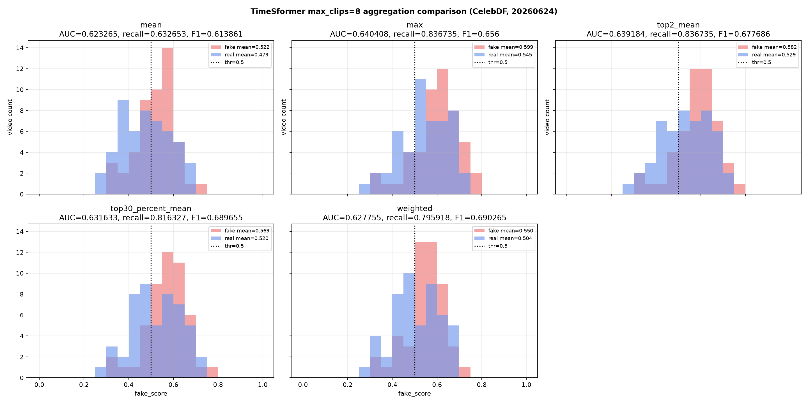

# TimeSformer Continuous max_clips=8 Aggregation 평가 (2026-06-24)

## 목적

`continuous sampler + head-only retrain` checkpoint를 고정하고,
`max_clips=8`에서 video score aggregation 방식만 바꿔 CelebDF 성능을 비교했다.
이번 단계에서는 재학습을 하지 않았다.

## 고정 조건

| 항목 | 값 |
|---|---:|
| checkpoint | `timesformer_continuous_sampler_celebdf_head_only_20260624.pth` |
| sampler | continuous |
| clip_frames | 8 |
| sampling_fps | 4 |
| max_clips | 8 |
| max_gap_ms | 500 |
| min_valid_face_ratio | 0.75 |
| threshold | 0.5 |
| retrain | 없음 |

## Threshold 0.5 기준 결과

| aggregation | eval_count | CelebDF AUC | accuracy | precision | fake_recall | F1 | TN | FP | FN | TP | fake_mean_score | real_mean_score | fake_median_score | real_median_score | no_face_count | insufficient_clip_count |
|---|---:|---:|---:|---:|---:|---:|---:|---:|---:|---:|---:|---:|---:|---:|---:|---:|
| mean | 99 | 0.6233 | 0.6061 | 0.5962 | 0.6327 | 0.6139 | 29 | 21 | 18 | 31 | 0.5217 | 0.4793 | 0.5283 | 0.4768 | 1 | 1 |
| max | 99 | 0.6404 | 0.5657 | 0.5395 | 0.8367 | 0.6560 | 15 | 35 | 8 | 41 | 0.5993 | 0.5449 | 0.6161 | 0.5419 | 1 | 1 |
| top2_mean | 99 | 0.6392 | 0.6061 | 0.5694 | 0.8367 | 0.6777 | 19 | 31 | 8 | 41 | 0.5816 | 0.5293 | 0.5910 | 0.5264 | 1 | 1 |
| top30_percent_mean | 99 | 0.6316 | 0.6364 | 0.5970 | 0.8163 | 0.6897 | 23 | 27 | 9 | 40 | 0.5686 | 0.5202 | 0.5774 | 0.5138 | 1 | 1 |
| weighted | 99 | 0.6278 | 0.6465 | 0.6094 | 0.7959 | 0.6903 | 25 | 25 | 10 | 39 | 0.5498 | 0.5038 | 0.5530 | 0.4958 | 1 | 1 |

## Threshold Sweep 진단

| aggregation | best_F1_threshold | best_F1 | best_F1_precision | best_F1_recall | best_recall_at_precision_0.60 | threshold_at_precision_0.60 | precision_at_best_recall_p60 |
|---|---:|---:|---:|---:|---:|---:|---:|
| mean | 0.4754 | 0.7018 | 0.6154 | 0.8163 | 0.8163 | 0.4737 | 0.6154 |
| max | 0.5359 | 0.6903 | 0.6094 | 0.7959 | 0.7959 | 0.5359 | 0.6094 |
| top2_mean | 0.5137 | 0.6957 | 0.6061 | 0.8163 | 0.8163 | 0.5137 | 0.6061 |
| top30_percent_mean | 0.5041 | 0.6957 | 0.6061 | 0.8163 | 0.8163 | 0.5041 | 0.6061 |
| weighted | 0.4980 | 0.7018 | 0.6154 | 0.8163 | 0.8367 | 0.4781 | 0.6029 |

## Score Distribution

## 결론

threshold 0.5 기준으로는 `weighted` aggregation이 가장 균형이 좋다.
F1은 0.6903, precision은 0.6094, fake recall은 0.7959로,
기존 mean aggregation의 F1 0.6139보다 크게 개선됐다.

AUC만 보면 `max`가 0.6404로 가장 높지만,
threshold 0.5에서는 FP가 35개로 크게 늘어 precision이 0.5395까지 떨어진다.
따라서 기본 후보는 `weighted = 0.4 * mean + 0.6 * top30_percent_mean`이 더 적합하다.

진단용 threshold sweep에서는 `weighted`가 precision 0.60 이상 조건에서
recall 0.8367까지 가능하다. 다만 최종 성능 주장은 threshold 0.5 기준과 AUC를 중심으로 두는 것이 안전하다.

## 산출물

- `ai-forensic/docs/data/timesformer-continuous-aggregation-celebdf/timesformer_continuous_sampler_celebdf_head_only_maxclips8_aggregation_eval_20260624_summary.csv`
- `ai-forensic/docs/data/timesformer-continuous-aggregation-celebdf/timesformer_continuous_sampler_celebdf_head_only_maxclips8_aggregation_eval_20260624_summary.json`
- `ai-forensic/docs/data/timesformer-continuous-aggregation-celebdf/timesformer_continuous_sampler_celebdf_head_only_maxclips8_aggregation_eval_20260624_video_scores.csv`
- `ai-forensic/docs/data/timesformer-continuous-aggregation-celebdf/timesformer_continuous_sampler_celebdf_head_only_maxclips8_aggregation_eval_20260624_no_face_insufficient_clip_cases.csv`
- `ai-forensic/docs/images/deepfake-results/timesformer_continuous_sampler_celebdf_head_only_maxclips8_aggregation_eval_20260624_score_distribution.png`

