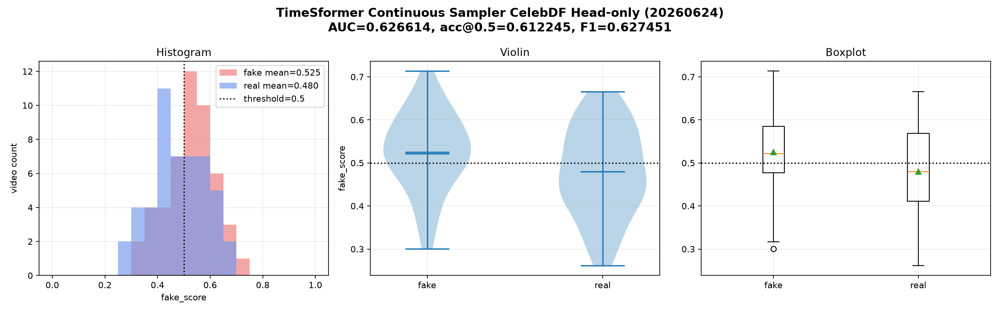

# TimeSformer Continuous Sampler Head-only 결과 (2026-06-24)

## 목적

기존 continuous sampler 평가는 weight를 바꾸지 않았기 때문에 성능 개선이 거의 없었다.
이번 실험은 sampler를 continuous 기준으로 고정한 뒤 TimeSformer head-only 재학습을 수행하여,
sampler 자체가 학습에 반영되면 CelebDF 성능이 개선되는지 확인했다.

## 고정 조건

| 항목 | 값 |
|---|---:|
| model | TimeSformer |
| sampler | continuous |
| dataset | CelebDF |
| clip_frames | 8 |
| sampling_fps | 4 |
| clip_duration_sec | 2.0 |
| max_clips | 4 |
| max_gap_ms | 500 |
| min_valid_face_ratio | 0.75 |
| backbone | freeze |
| partial unfreeze | 사용 안 함 |
| lr | 2e-5 |
| epochs | 3 |
| batch size | 1 |
| train samples | fake 100 / real 100 |
| threshold | 0.5 |

## 1. 동일 98개 기준 기존 vs continuous 평가

continuous sampler에서 score가 나온 98개 video_id만 기준으로 기존 sampler 결과도 필터링했다.

| sampler | AUC | accuracy | precision | recall | F1 | confusion matrix | fake mean | real mean |
|---|---:|---:|---:|---:|---:|---|---:|---:|
| existing sampler adapted same98 | 0.5864 | 0.5510 | 0.5510 | 0.5510 | 0.5510 | TN 27 / FP 22 / FN 22 / TP 27 | 0.5046 | 0.4727 |
| continuous sampler adapted 4fps same98 | 0.5764 | 0.5510 | 0.5556 | 0.5102 | 0.5319 | TN 29 / FP 20 / FN 24 / TP 25 | 0.4947 | 0.4647 |

이 비교에서는 기존 weight를 그대로 쓰면 continuous sampler가 성능을 올리지는 못한다.

## 2. Continuous sampler head-only 재학습 결과

| 실험 | training sampler | eval sampler | AUC | accuracy | precision | recall | F1 | confusion matrix |
|---|---|---|---:|---:|---:|---:|---:|---|
| 기존 head-only adapted | existing sparse sampler | existing sparse sampler | 0.5740 | 0.5400 | 0.5400 | 0.5400 | 0.5400 | TN 27 / FP 23 / FN 23 / TP 27 |
| 기존 weight + continuous 평가 | existing sparse sampler | continuous 4fps | 0.5764 | 0.5510 | 0.5556 | 0.5102 | 0.5319 | TN 29 / FP 20 / FN 24 / TP 25 |
| continuous head-only 재학습 | continuous 4fps | continuous 4fps | 0.6266 | 0.6122 | 0.6038 | 0.6531 | 0.6275 | TN 28 / FP 21 / FN 17 / TP 32 |

## 3. Score 분포

| label | mean | median |
|---|---:|---:|
| fake | 0.5252 | 0.5218 |
| real | 0.4798 | 0.4800 |

fake와 real 분포는 여전히 겹치지만, continuous 기준으로 재학습한 뒤 fake score가 위로 이동했고
fake recall이 0.5400에서 0.6531로 개선됐다.

## 4. no_face / insufficient clip

CelebDF 100개 중 98개가 score 계산에 사용됐고, 2개는 no_face 또는 insufficient clip으로 제외됐다.

## 결론

continuous sampler는 weight를 그대로 평가할 때는 효과가 거의 없었지만,
continuous sampler 기준으로 head-only 재학습하면 CelebDF AUC가 0.5740에서 0.6266으로 개선됐다.

따라서 다음 단계는 partial unfreeze나 clip_frames 증가 전에,
현재 continuous sampler pipeline을 기준으로 face crop 안정화와 threshold/aggregation 튜닝을 먼저 확인하는 것이 좋다.

## 산출물

- `ai-forensic/docs/data/timesformer-continuous-head-only-celebdf/timesformer_continuous_sampler_celebdf_same98_metrics_comparison_20260624.csv`
- `ai-forensic/docs/data/timesformer-continuous-head-only-celebdf/timesformer_continuous_sampler_celebdf_same98_matched_predictions_20260624.csv`
- `ai-forensic/docs/data/timesformer-continuous-head-only-celebdf/timesformer_continuous_sampler_celebdf_head_only_20260624_predictions.csv`
- `ai-forensic/docs/data/timesformer-continuous-head-only-celebdf/timesformer_continuous_sampler_celebdf_head_only_20260624_metrics.csv`
- `ai-forensic/docs/data/timesformer-continuous-head-only-celebdf/timesformer_continuous_sampler_celebdf_head_only_20260624_metrics.json`
- `ai-forensic/docs/data/timesformer-continuous-head-only-celebdf/timesformer_continuous_sampler_celebdf_head_only_20260624_clip_audit.csv`
- `ai-forensic/docs/data/timesformer-continuous-head-only-celebdf/timesformer_continuous_sampler_celebdf_head_only_20260624_no_face_insufficient_clip_cases.csv`
- `ai-forensic/docs/data/timesformer-continuous-head-only-celebdf/timesformer_continuous_sampler_celebdf_head_only_20260624_training_comparison.csv`
- `ai-forensic/docs/data/timesformer-continuous-head-only-celebdf/timesformer_continuous_sampler_celebdf_head_only_20260624_training_comparison.json`
- `ai-forensic/docs/images/deepfake-results/timesformer_continuous_sampler_celebdf_head_only_20260624_score_distribution.png`

원격 weight:

- `/home/sk4team/forenShield-ai/models/test/video/timesformer/v1.0.0/timesformer_continuous_sampler_celebdf_head_only_20260624.pth`

