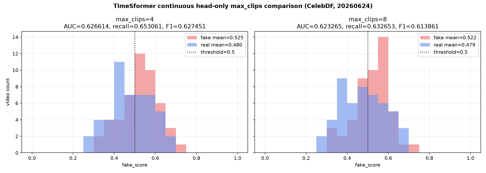

# TimeSformer Continuous Sampler max_clips 평가 (2026-06-24)

## 목적

현재 best checkpoint인 `continuous sampler + head-only retrain` 모델을 고정하고,
재학습 없이 `max_clips=4`와 `max_clips=8` 평가만 비교했다.

## 고정 조건

| 항목 | 값 |
|---|---:|
| checkpoint | `timesformer_continuous_sampler_celebdf_head_only_20260624.pth` |
| sampler | continuous |
| clip_frames | 8 |
| sampling_fps | 4 |
| clip_duration_sec | 2.0 |
| max_gap_ms | 500 |
| min_valid_face_ratio | 0.75 |
| dataset | CelebDF benchmark 100 |
| retrain | 없음 |
| partial unfreeze | 없음 |

## 전체 평가 결과

| experiment_name | eval_count | CelebDF AUC | accuracy | precision | fake_recall | F1 | TN | FP | FN | TP | fake_mean_score | real_mean_score | fake_median_score | real_median_score | no_face_count | insufficient_clip_count |
|---|---:|---:|---:|---:|---:|---:|---:|---:|---:|---:|---:|---:|---:|---:|---:|---:|
| continuous sampler + head-only retrain + max_clips=4 | 98 | 0.6266 | 0.6122 | 0.6038 | 0.6531 | 0.6275 | 28 | 21 | 17 | 32 | 0.5251 | 0.4798 | 0.5218 | 0.4800 | 2 | 2 |
| continuous sampler + head-only retrain + max_clips=8 | 99 | 0.6233 | 0.6061 | 0.5962 | 0.6327 | 0.6139 | 29 | 21 | 18 | 31 | 0.5217 | 0.4793 | 0.5283 | 0.4768 | 1 | 1 |

## 동일 98개 기준 비교

`max_clips=4`에서 score가 나온 동일한 98개 video_id만 기준으로 다시 비교했다.

| experiment_name | eval_count | CelebDF AUC | accuracy | precision | fake_recall | F1 | TN | FP | FN | TP | fake_mean_score | real_mean_score |
|---|---:|---:|---:|---:|---:|---:|---:|---:|---:|---:|---:|---:|
| 기존 sampler + 기존 weight (same 98) | 98 | 0.5864 | 0.5510 | 0.5510 | 0.5510 | 0.5510 | 27 | 22 | 22 | 27 | 0.5046 | 0.4727 |
| continuous sampler + head-only retrain + max_clips=4 (same 98) | 98 | 0.6266 | 0.6122 | 0.6038 | 0.6531 | 0.6275 | 28 | 21 | 17 | 32 | 0.5251 | 0.4798 |
| continuous sampler + head-only retrain + max_clips=8 (same 98) | 98 | 0.6356 | 0.6122 | 0.6078 | 0.6327 | 0.6200 | 29 | 20 | 18 | 31 | 0.5217 | 0.4756 |

## Score Distribution

## Clip Audit

| max_clips | clip_count | NON_CONTIGUOUS_CLIP | ratio |
|---|---:|---:|---:|
| 4 | 389 | 0 | 0.0000 |
| 8 | 767 | 0 | 0.0000 |

## 결론

`max_clips=8`은 no_face / insufficient clip을 2개에서 1개로 줄였지만,
전체 100개 기준 CelebDF AUC, fake recall, F1은 `max_clips=4`보다 개선되지 않았다.

동일 98개 기준에서는 `max_clips=8`의 AUC가 0.6356으로 더 높지만,
fake recall과 F1은 `max_clips=4`가 더 좋다. 현재 목표가 fake 탐지 성능과 안정적인 F1이라면
다음 단계의 기본값은 `max_clips=4` 유지가 더 타당하다.

## 산출물

- `ai-forensic/docs/data/timesformer-continuous-maxclips-celebdf/timesformer_continuous_sampler_celebdf_head_only_maxclips4_vs_8_eval_summary_20260624.csv`
- `ai-forensic/docs/data/timesformer-continuous-maxclips-celebdf/timesformer_continuous_sampler_celebdf_same98_existing_vs_headonly_maxclips4_8_20260624.csv`
- `ai-forensic/docs/data/timesformer-continuous-maxclips-celebdf/timesformer_continuous_sampler_celebdf_head_only_maxclips4_eval_20260624_predictions.csv`
- `ai-forensic/docs/data/timesformer-continuous-maxclips-celebdf/timesformer_continuous_sampler_celebdf_head_only_maxclips8_eval_20260624_predictions.csv`
- `ai-forensic/docs/data/timesformer-continuous-maxclips-celebdf/timesformer_continuous_sampler_celebdf_head_only_maxclips4_eval_20260624_no_face_insufficient_clip_cases.csv`
- `ai-forensic/docs/data/timesformer-continuous-maxclips-celebdf/timesformer_continuous_sampler_celebdf_head_only_maxclips8_eval_20260624_no_face_insufficient_clip_cases.csv`
- `ai-forensic/docs/images/deepfake-results/timesformer_continuous_sampler_celebdf_head_only_maxclips4_vs_8_score_distribution_20260624.png`

